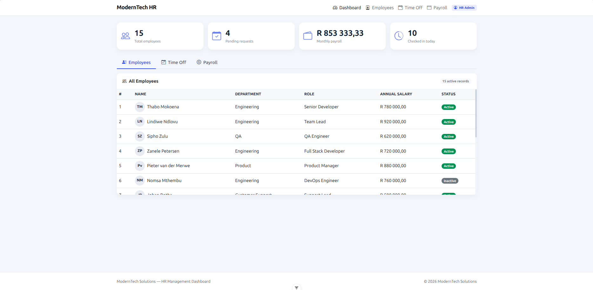

# ModernTech Solutions: HR Management Dashboard

A proof-of-concept Human Resources management system built with Vue.js 3 and Bootstrap, demonstrating centralised employee data, automated payroll, and streamlined time-off management.



## Technologies Used

- **Vue.js 3**
- **Bootstrap 5**
- **JavaScript**
- **HTML/CSS**

## Key Features

- **Employee Management** - Centralised employee database with 15+ South African dummy records
- **Time-Off Requests** - Digital submission with Approve/Reject workflow
- **Payroll Automation** - Real-time calculations
- **Payslip Generation** - Detailed breakdown with deductions (UIF, SDL, Medical Aid, Pension)
- **Attendance Tracking** - Check-in/Check-out functionality
- **Responsive Design** - Works on desktop, tablet, and mobile

## Project Structure

```bash
src/
├── App.vue
├── main.js
├── assets/
│ └── styles.css
├── components/
│ ├── Header.vue
│ ├── Footer.vue
│ ├── EmployeeList.vue
│ ├── TimeOffRequests.vue
│ └── PayrollSection.vue
└── composables/
├── useEmployees.js
└── useHRLogic.js

```

## Setup Instructions

### Installation

```bash
# Clone the repository
cd

# Install dependencies
npm install

# Run development server
npm run dev

# Build for production
npm run build
Load Bootstrap via CDN
Bootstrap is loaded via CDN in index.html:

html
<link href="https://cdn.jsdelivr.net/npm/bootstrap@5.3.0-alpha1/dist/css/bootstrap.min.css" rel="stylesheet" />
<link rel="stylesheet" href="https://cdn.jsdelivr.net/npm/bootstrap-icons@1.11.1/font/bootstrap-icons.css" />
<script src="https://cdn.jsdelivr.net/npm/bootstrap@5.3.0-alpha1/dist/js/bootstrap.bundle.min.js" defer></script>
```

## How to Use

### Dashboard

View key metrics: Total employees, pending requests, monthly payroll, attendance count

Quick access to all modules via navigation tabs

### Employees Tab

View complete employee list

See salaries ### with proper formatting

Identify active/inactive staff with status badges

### Time Off Tab

View requests with status indicators (Pending, Approved, Rejected)

Approve or Reject pending requests with one click

Add new requests using the form with employee auto-complete

### Payroll Tab

View monthly payroll summary

Select employee from dropdown

Generate detailed payslip with breakdown

### Attendance Tracking

Dashboard shows real-time attendance count

Attendance rate calculated based on active employees
